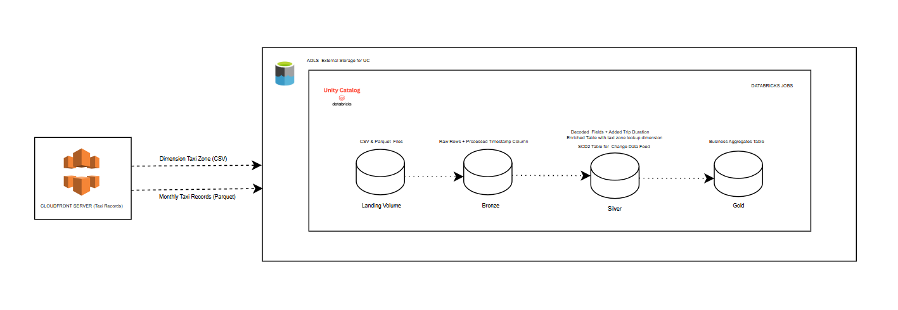
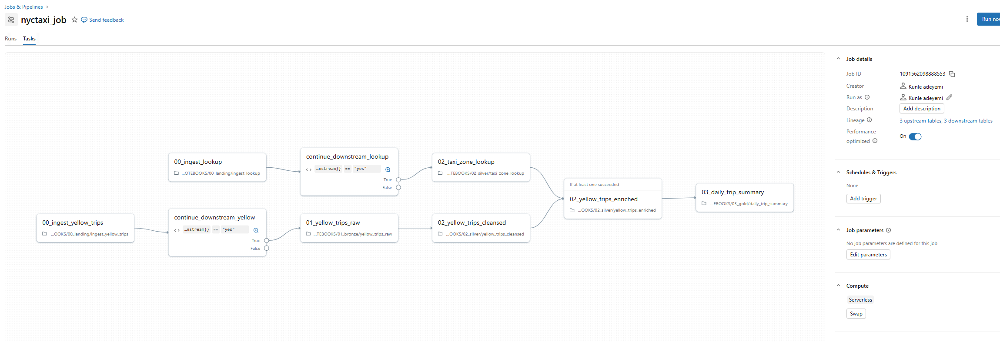

# taxi_databricks

An end-to-end data engineering pipeline that ingests, transforms, and analyses NYC Yellow Taxi trip data on Databricks using a Medallion Architecture with Unity Catalog.

---

## Architecture




The pipeline runs on a **2-month lag** — a job running in May processes March data. This accounts for the NYC TLC's typical data publication delay.

---

## Repository structure

```
modules/          Reusable Python code
transformations/  Databricks notebooks organised by medallion layer
one_off/          Setup and backfill scripts
adhoc/            Exploratory analysis 
```

---

## Prerequisites

- Databricks workspace with Unity Catalog enabled
- A cluster with access to the `nyctaxi` catalog
- The `delta` Python library (pre-installed on Databricks Runtime)

---

## One-time setup

Run these notebooks **once** in order from the `one_off/` directory:

1. **`creating_catalogs_schema_volumes.py`** — Creates the `nyctaxi` catalog, four schemas (`00_landing`, `01_bronze`, `02_silver`, `03_gold`), and the landing volume.
2. **`load_zone_lookup.py`** — Downloads the taxi zone CSV into the landing volume.
3. **`initial_load/notebooks/`** — Runs the full pipeline over 6 months of historical data (Sept 2025 – Feb 2026) to seed all tables.

### Installing modules as a package (recommended)

To avoid any `sys.path` issues, install the project as a package on your cluster:

```python
# Run in a notebook cell or as a cluster init script
%pip install -e /Workspace/path/to/taxi_databricks
```

Alternatively, every production notebook already calls `%run ../bootstrap` which walks the directory tree to find and register the project root automatically — no manual setup required.

---

## Scheduled pipeline

The production notebooks in `transformations/notebooks/` are designed to run as a **Databricks Job** with dependent tasks in this order:



---

## Configuration

All catalog names, schema names, table names, volume paths, and source URLs are defined in a single file — [`modules/config.py`](modules/config.py). To point the pipeline at a different catalog or environment, edit only that file.

| Constant | Default value |
|----------|---------------|
| `CATALOG` | `nyctaxi` |
| `SCHEMA_LANDING` | `00_landing` |
| `SCHEMA_BRONZE` | `01_bronze` |
| `SCHEMA_SILVER` | `02_silver` |
| `SCHEMA_GOLD` | `03_gold` |
| `YELLOW_TAXI_SOURCE_URL` | NYC TLC endpoint |
| `ZONE_LOOKUP_URL` | NYC TLC Dimension table endpoint |

---

## Data sources

- **Yellow trip data**: [NYC TLC Trip Record Data](https://www.nyc.gov/site/tlc/about/tlc-trip-record-data.page) — monthly Parquet files
- **Taxi zone lookup**: CSV mapping `LocationID` → Borough, Zone, Service Zone
